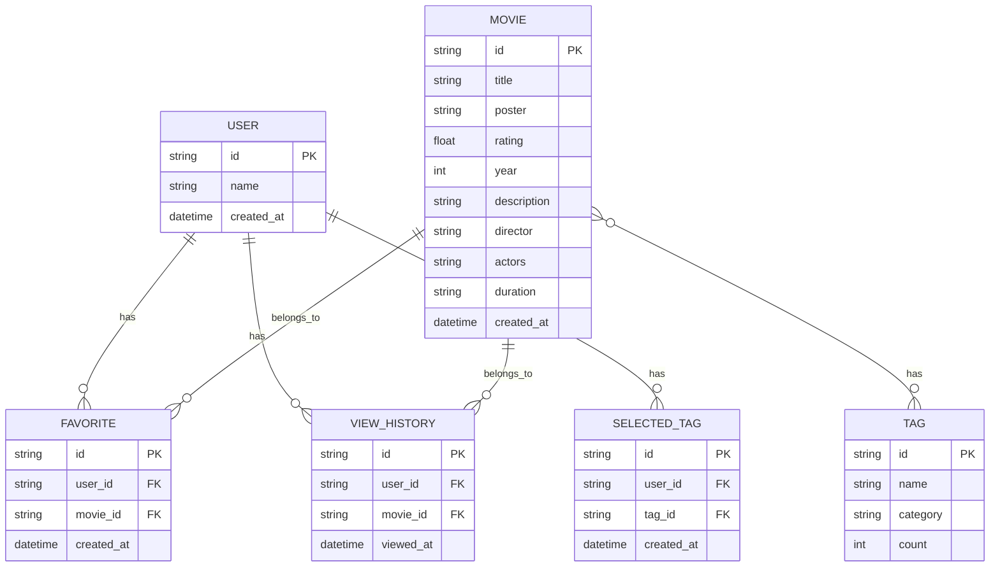

# 基于标签匹配的高分影视推荐+AI趣味影评小程序

## 概要设计说明书

---

## 一、引言

### （一）编写目的

本说明书旨在对"基于标签匹配的高分影视推荐+AI趣味影评小程序"进行概要设计，定义系统架构、模块划分、数据结构、接口设计等，为详细设计和开发提供指导。

### （二）项目背景

随着互联网影视内容的爆炸式增长，用户面临"选择困难"问题。本项目通过标签匹配算法实现精准个性化推荐，并结合AI技术生成趣味影评，提升用户观影体验。

### （三）术语定义

| 术语 | 定义 |
|------|------|
| TMDB | The Movie Database，免费电影数据库API |
| 标签匹配 | 根据用户选择的标签与电影标签的匹配程度进行推荐 |
| AI影评 | 利用人工智能技术自动生成的电影评论 |
| Taro | 多端开发框架，支持React/Vue开发微信小程序、H5等 |

---

## 二、需求概述

### （一）功能需求概述

| 模块 | 功能 |
|------|------|
| 首页 | 电影列表展示、标签筛选、搜索 |
| 标签页 | 标签分类、选择、匹配计算 |
| 详情页 | 电影详情、AI影评、收藏、相关推荐 |
| 我的页 | 收藏列表、浏览历史 |
| 数据服务 | TMDB API、本地缓存、AI影评API |

### （二）非功能需求概述

| 需求类型 | 要求 |
|----------|------|
| 性能 | 首屏加载≤3秒，标签筛选≤1秒，AI影评生成≤5秒 |
| 兼容性 | 支持微信小程序基础库≥2.20.0，iOS/Android系统 |
| 可用性 | 用户操作路径≤3层，界面简洁美观 |
| 安全性 | API密钥安全存储，用户数据加密 |

---

## 三、总体设计

### （一）系统架构

采用经典的MVC架构模式：

```
┌─────────────────────────────────────────┐
│              View（视图层）              │
│   Taro页面组件：首页、标签页、详情页、我的页   │
├─────────────────────────────────────────┤
│            Controller（控制层）          │
│     React Hooks状态管理、业务逻辑处理        │
├─────────────────────────────────────────┤
│              Model（模型层）             │
│      数据获取、存储、处理、算法计算          │
├─────────────────────────────────────────┤
│              外部依赖                    │
│   TMDB API、Silicon Flow API、本地存储     │
└─────────────────────────────────────────┘
```

### （二）数据库ER图



**实体说明**：

| 实体 | 说明 | 主要属性 |
|------|------|----------|
| User | 用户 | 用户ID、用户名、创建时间 |
| Movie | 电影 | 电影ID、标题、海报、评分、年份、简介、导演、演员、时长 |
| Tag | 标签 | 标签ID、名称、分类、使用次数 |
| Favorite | 收藏 | 收藏ID、用户ID、电影ID、收藏时间 |
| ViewHistory | 浏览历史 | 历史ID、用户ID、电影ID、浏览时间 |
| SelectedTag | 已选标签 | 选中标签ID、用户ID、标签ID、选择时间 |

**实体关系**：

| 关系 | 类型 | 说明 |
|------|------|------|
| User - Favorite | 一对多 | 一个用户可以收藏多部电影 |
| User - ViewHistory | 一对多 | 一个用户可以有多条浏览记录 |
| User - SelectedTag | 一对多 | 一个用户可以选中多个标签 |
| Movie - Favorite | 一对多 | 一部电影可以被多个用户收藏 |
| Movie - ViewHistory | 一对多 | 一部电影可以有多条浏览记录 |
| Movie - Tag | 多对多 | 一部电影可以有多个标签 |

### （三）界面原型设计

#### 3.1 首页原型

```
┌────────────────────────────────────────┐
│ ☰ 影视推荐                    搜索... │
├────────────────────────────────────────┤
│ [科幻] [喜剧] [动作] [爱情] [悬疑] [更多] │
├────────────────────────────────────────┤
│                                        │
│  ┌─────────┐  ┌─────────┐             │
│  │ 海报     │  │ 海报     │             │
│  │         │  │         │             │
│  ├─────────┤  ├─────────┤             │
│  │ 肖申克的救赎│  │ 霸王别姬  │             │
│  │ ⭐ 9.7  │  │ ⭐ 9.6  │             │
│  │ 1994    │  │ 1993    │             │
│  └─────────┘  └─────────┘             │
│                                        │
│  ┌─────────┐  ┌─────────┐             │
│  │ 海报     │  │ 海报     │             │
│  │         │  │         │             │
│  ├─────────┤  ├─────────┤             │
│  │ 阿甘正传  │  │ 千与千寻  │             │
│  │ ⭐ 9.5  │  │ ⭐ 9.3  │             │
│  │ 1994    │  │ 2001    │             │
│  └─────────┘  └─────────┘             │
│                                        │
└────────────────────────────────────────┘
```

**页面说明**：
- 顶部：标题栏 + 搜索框
- 中部：标签筛选栏（可左右滑动）
- 底部：电影列表（卡片式网格布局）

#### 3.2 标签选择页原型

```
┌────────────────────────────────────────┐
│ ← 选择标签                        确认 │
├────────────────────────────────────────┤
│ 搜索标签...                              │
├────────────────────────────────────────┤
│ [热门] [情感] [冒险] [科幻] [喜剧]      │
├────────────────────────────────────────┤
│                                        │
│  ○ 科幻    ○ 喜剧    ○ 动作             │
│  ● 冒险    ○ 爱情    ○ 悬疑             │
│  ○ 剧情    ○ 战争    ○ 恐怖             │
│  ○ 动画    ○ 纪录    ○ 奇幻             │
│                                        │
│  已选择 3 个标签                        │
│                                        │
│  ┌──────────────────────────────────┐  │
│  │           取消                    │  │
│  │           确认                    │  │
│  └──────────────────────────────────┘  │
│                                        │
└────────────────────────────────────────┘
```

**页面说明**：
- 顶部：返回按钮 + 标题 + 确认按钮
- 中部：标签分类导航 + 标签列表（圆形复选框）
- 底部：操作按钮

#### 3.3 电影详情页原型

```
┌────────────────────────────────────────┐
│ ← 返回                                   │
├────────────────────────────────────────┤
│  ┌──────────────────────────────────┐  │
│  │                                   │  │
│  │            海报区域                 │  │
│  │                                   │  │
│  └──────────────────────────────────┘  │
│                                        │
│  肖申克的救赎  ⭐ 9.7  1994  142分钟    │
│                                        │
│  导演：陈凯歌                          │
│  演员：张国荣、张丰毅、巩俐              │
│                                        │
│  简介：                                  │
│  一场商业化的运作，却保留了原著的文学      │
│  精髓，展现了程蝶衣的悲喜人生...         │
│                                        │
├────────────────────────────────────────┤
│ AI影评                                  │
│ [搞笑吐槽] [文艺走心] [硬核解析]         │
│ [朋友圈短句]                            │
│                                        │
│ ┌────────────────────────────────────┐ │
│ │                                     │ │
│ │ 这部电影简直是神作！每一个镜头都      │ │
│ │ 让人叹为观止，演技炸裂，剧情反转     │ │
│ │ 更是让人措手不及...                 │ │
│ │                                     │ │
│ └────────────────────────────────────┘ │
│                                        │
│ [收藏]              [相关推荐 ▼]        │
│                                        │
│ 相关推荐：                               │
│ ┌────────┐ ┌────────┐ ┌────────┐       │
│ │ 电影1  │ │ 电影2  │ │ 电影3  │       │
│ └────────┘ └────────┘ └────────┘       │
│                                        │
└────────────────────────────────────────┘
```

**页面说明**：
- 顶部：返回按钮
- 区域1：电影海报（可横滑查看多图）
- 区域2：电影基本信息
- 区域3：AI影评生成区
- 区域4：收藏按钮 + 相关推荐

#### 3.4 我的页原型

```
┌────────────────────────────────────────┐
│ 我的                                    │
├────────────────────────────────────────┤
│  ┌──────┐                              │
│  │ 头像 │ 电影爱好者                    │
│  └──────┘                              │
├────────────────────────────────────────┤
│                                        │
│  我的收藏 (12)                          │
│  ┌──────────────────────────────────┐  │
│  │ 肖申克的救赎  ⭐9.7      [取消收藏] │  │
│  ├──────────────────────────────────┤  │
│  │ 阿甘正传    ⭐9.5      [取消收藏] │  │
│  └──────────────────────────────────┘  │
│                                        │
│  浏览历史 (5)                  [清空]  │
│  ┌──────────────────────────────────┐  │
│  │ 千与千寻    ⭐9.3              │  │
│  ├──────────────────────────────────┤  │
│  │ 盗梦空间    ⭐9.2              │  │
│  └──────────────────────────────────┘  │
│                                        │
├────────────────────────────────────────┤
│  版本号: V1.0.0                         │
│  关于我们 | 联系方式                    │
└────────────────────────────────────────┘
```

**页面说明**：
- 顶部：用户头像和昵称
- 区域1：收藏列表（可取消收藏）
- 区域2：浏览历史（可清空）
- 底部：版本信息和链接

### （二）模块划分

| 模块 | 子模块 | 职责 |
|------|--------|------|
| 首页模块 | 搜索、标签筛选、电影列表 | 展示电影列表和筛选功能 |
| 标签模块 | 标签分类、选择、匹配计算 | 标签管理和推荐计算 |
| 详情模块 | 电影详情、AI影评、收藏、相关推荐 | 电影详情展示和互动功能 |
| 我的模块 | 收藏列表、浏览历史 | 用户数据管理 |
| 数据服务模块 | TMDB API、本地缓存、AI影评API | 数据获取和处理 |
| 工具模块 | 存储、日志、工具函数 | 通用工具函数 |

### （三）技术选型

| 模块 | 技术 | 版本 |
|------|------|------|
| 前端框架 | Taro | 4.2.0 |
| 语言 | TypeScript | 5.x |
| 样式 | SCSS Modules | - |
| 状态管理 | React Hooks | - |
| 数据存储 | 微信小程序Storage | - |
| 第三方API | TMDB API、Silicon Flow API | - |

---

## 四、详细设计

### （一）页面结构设计

#### 4.1.1 首页（/pages/home）

| 组件 | 功能 |
|------|------|
| SearchBar | 搜索框组件 |
| TagFilter | 标签筛选栏组件 |
| MovieList | 电影列表组件 |
| MovieCard | 电影卡片组件 |

#### 4.1.2 标签页（/pages/tags）

| 组件 | 功能 |
|------|------|
| TagSearch | 标签搜索组件 |
| TagCategory | 标签分类导航组件 |
| TagList | 标签列表组件 |
| TagItem | 标签项组件 |

#### 4.1.3 详情页（/pages/detail）

| 组件 | 功能 |
|------|------|
| MovieHeader | 电影头部信息组件 |
| MovieInfo | 电影详细信息组件 |
| AI Review | AI影评生成组件 |
| ReviewCard | 影评卡片组件 |
| RelatedMovies | 相关推荐组件 |

#### 4.1.4 我的页（/pages/mine）

| 组件 | 功能 |
|------|------|
| UserHeader | 用户头部信息组件 |
| FavoriteList | 收藏列表组件 |
| HistoryList | 浏览历史组件 |

### （二）核心算法设计

#### 4.2.1 标签匹配推荐算法

**输入**: 用户选中的标签列表（如 ["科幻", "动作"]）

**处理流程**:
1. 遍历所有电影数据
2. 对每部电影计算匹配标签数
3. 计算匹配度 = 匹配标签数 / 选中标签总数
4. 按匹配度降序排序
5. 过滤匹配度大于0的电影

**输出**: 按匹配度排序的电影列表

**算法复杂度**: O(n*m)，其中n为电影数量，m为标签数量

**伪代码**:
```
function getRecommendedByTags(selectedTags):
    movies = getAllMovies()
    scoredMovies = []
    
    for each movie in movies:
        matchCount = count of tags in movie.tags that are in selectedTags
        matchScore = matchCount / length(selectedTags)
        add { movie, matchScore } to scoredMovies
    
    sort scoredMovies by matchScore descending
    filtered = filter scoredMovies where matchScore > 0
    return [movie for { movie, score } in filtered]
```

#### 4.2.2 AI趣味影评生成

**输入**: 电影名称、电影简介、风格类型

**处理流程**:
1. 构造Prompt模板
2. 调用Silicon Flow API
3. 解析返回结果
4. 展示给用户

**支持风格**:
| 风格 | 描述 |
|------|------|
| 搞笑吐槽 | 幽默风趣的吐槽式影评 |
| 文艺走心 | 感性细腻的文艺影评 |
| 硬核解析 | 深度分析的专业影评 |
| 朋友圈短句 | 适合社交分享的短评 |

**Prompt模板示例**:
```
请为电影《{title}》生成一篇{style}风格的影评。

电影简介：{description}

要求：
1. 字数控制在200字以内
2. {style}风格特点明显
3. 语言生动有趣
```

### （三）数据结构设计

#### 4.3.1 Movie（电影）

```typescript
interface Movie {
  id: string;           // 电影ID
  title: string;        // 电影标题
  poster: string;       // 海报URL
  rating: number;       // 评分（0-10）
  year: number;         // 上映年份
  tags: string[];       // 标签列表
  description: string;  // 简介
  director: string;     // 导演
  actors: string[];     // 演员列表
  duration: string;     // 时长
  review: string;       // AI影评
}
```

#### 4.3.2 Tag（标签）

```typescript
interface Tag {
  id: string;       // 标签ID
  name: string;     // 标签名称
  category: string; // 分类（热门、情感、冒险等）
  count: number;    // 使用次数
}
```

#### 4.3.3 UserPreference（用户偏好）

```typescript
interface UserPreference {
  favoriteMovies: string[]; // 收藏电影ID列表
  viewHistory: string[];    // 浏览历史ID列表
  selectedTags: string[];   // 选中标签列表
}
```

### （四）接口设计

#### 4.4.1 TMDB API接口

| API | 方法 | 说明 |
|-----|------|------|
| /movie/top_rated | GET | 获取高分电影列表 |
| /movie/popular | GET | 获取热门电影列表 |
| /movie/{id} | GET | 获取电影详情 |

**请求示例**:
```
GET https://api.themoviedb.org/3/movie/top_rated?api_key=xxx&language=zh-CN&page=1
```

**响应示例**:
```json
{
  "page": 1,
  "results": [
    {
      "id": 550,
      "title": "搏击俱乐部",
      "poster_path": "/pB8BM7pdSp6B6Ih7QZ4DrQ3PmJK.jpg",
      "vote_average": 8.8,
      "release_date": "1999-10-15",
      "genre_ids": [18, 53],
      "overview": "电影简介..."
    }
  ],
  "total_pages": 500
}
```

#### 4.4.2 Silicon Flow API接口

| API | 方法 | 说明 |
|-----|------|------|
| /chat/completions | POST | 生成AI影评 |

**请求示例**:
```json
{
  "model": "siliconflow-3.5",
  "messages": [
    {
      "role": "user",
      "content": "请为电影《搏击俱乐部》生成一篇搞笑吐槽风格的影评..."
    }
  ]
}
```

**响应示例**:
```json
{
  "choices": [
    {
      "message": {
        "content": "AI生成的影评内容..."
      }
    }
  ]
}
```

#### 4.4.3 本地存储接口

| 方法 | 说明 |
|------|------|
| storage.set(key, value) | 保存数据 |
| storage.get(key, defaultValue) | 获取数据 |
| storage.remove(key) | 删除数据 |

**使用示例**:
```typescript
// 保存收藏
storage.set('favoriteMovies', ['550', '680']);

// 获取收藏
const favorites = storage.get<string[]>('favoriteMovies', []);
```

### （五）状态管理设计

使用React Hooks实现全局状态管理：

```typescript
interface AppState {
  movies: Movie[];           // 电影列表
  selectedTags: string[];    // 选中标签
  searchKeyword: string;     // 搜索关键词
  currentPage: string;       // 当前页面
  loading: boolean;          // 加载状态
}
```

**状态更新机制**:
1. 用户选择标签 → 更新selectedTags → 触发推荐计算
2. 用户搜索 → 更新searchKeyword → 触发搜索过滤
3. 数据加载完成 → 更新movies → 触发页面渲染

### （六）异常处理设计

#### 4.6.1 网络异常处理

| 异常类型 | 处理方式 |
|----------|----------|
| TMDB API连接超时 | 自动切换本地备选数据 |
| AI API调用失败 | 提示用户稍后重试 |
| 网络请求失败 | 展示友好提示 |

#### 4.6.2 数据异常处理

| 异常类型 | 处理方式 |
|----------|----------|
| 电影数据为空 | 展示空状态提示 |
| 标签匹配结果为空 | 提示"暂无匹配电影" |
| 存储操作失败 | 静默处理并记录日志 |

---

## 五、部署与集成方案

### （一）微信小程序部署

1. 编译生成dist/weapp目录
2. 微信开发者工具导入项目
3. 配置小程序基础信息
4. 提交审核上线

### （二）H5部署

1. 编译生成dist/h5目录
2. 部署到静态服务器（如Nginx）
3. 配置域名和HTTPS

### （三）API密钥管理

- TMDB API密钥：通过环境变量配置
- Silicon Flow API密钥：通过环境变量配置
- 禁止在前端代码中硬编码密钥

---

## 六、测试计划

### （一）测试范围

| 测试类型 | 范围 |
|----------|------|
| 功能测试 | 各模块功能验证 |
| 性能测试 | 首屏加载、响应时间 |
| 兼容性测试 | 不同设备、不同系统 |
| 异常测试 | 网络异常、数据异常 |

### （二）测试用例（示例）

#### 标签筛选功能测试

| 用例ID | 测试场景 | 预期结果 |
|--------|----------|----------|
| TC001 | 单标签选择 | 展示匹配该标签的电影 |
| TC002 | 多标签选择 | 展示同时匹配多个标签的电影 |
| TC003 | 无标签选择 | 展示所有电影 |
| TC004 | 无匹配标签 | 提示"暂无匹配电影" |

#### AI影评生成测试

| 用例ID | 测试场景 | 预期结果 |
|--------|----------|----------|
| TC005 | 搞笑吐槽风格 | 生成幽默风趣的影评 |
| TC006 | 文艺走心风格 | 生成感性细腻的影评 |
| TC007 | 硬核解析风格 | 生成深度分析的影评 |
| TC008 | 朋友圈短句风格 | 生成适合分享的短评 |
| TC009 | API调用失败 | 提示"生成失败，请重试" |

#### 收藏功能测试

| 用例ID | 测试场景 | 预期结果 |
|--------|----------|----------|
| TC010 | 添加收藏 | 电影加入收藏列表 |
| TC011 | 取消收藏 | 电影从收藏列表移除 |
| TC012 | 重复收藏 | 不重复添加 |

---

## 七、开发计划

### （一）阶段划分

| 阶段 | 时间 | 任务 |
|------|------|------|
| 第一阶段 | 第1周 | 基础框架搭建 |
| 第二阶段 | 第2-3周 | 首页与标签页开发 |
| 第三阶段 | 第4-5周 | 详情页与AI影评集成 |
| 第四阶段 | 第6周 | 我的页与优化 |
| 第五阶段 | 第7-8周 | 测试与上线 |

### （二）里程碑

| 里程碑 | 时间 | 交付物 |
|--------|------|--------|
| M1 | 第1周 | 基础框架完成 |
| M2 | 第3周 | 首页与标签功能完成 |
| M3 | 第5周 | 详情页与AI影评完成 |
| M4 | 第6周 | 所有功能完成 |
| M5 | 第8周 | 测试通过，上线发布 |

---

**文档日期**: 2026年6月
**文档版本**: V1.0
