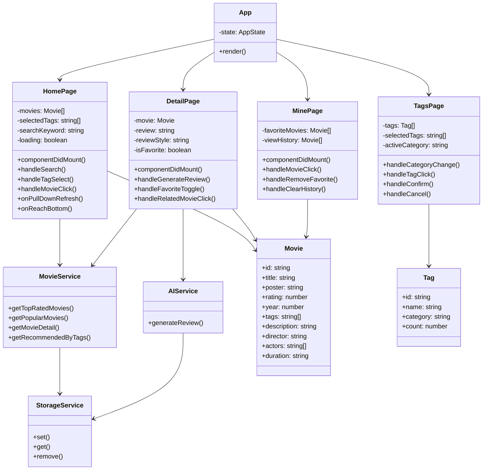
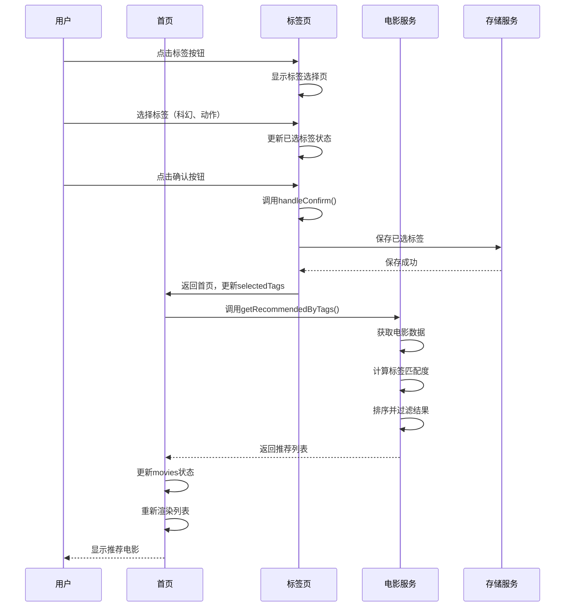
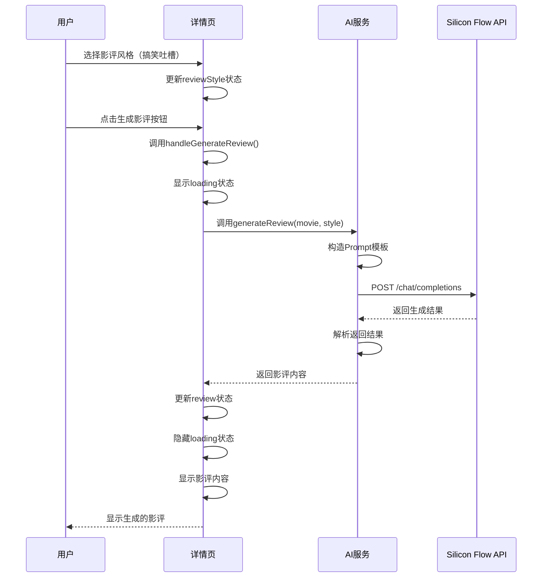
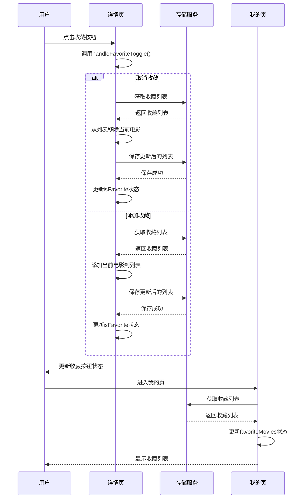
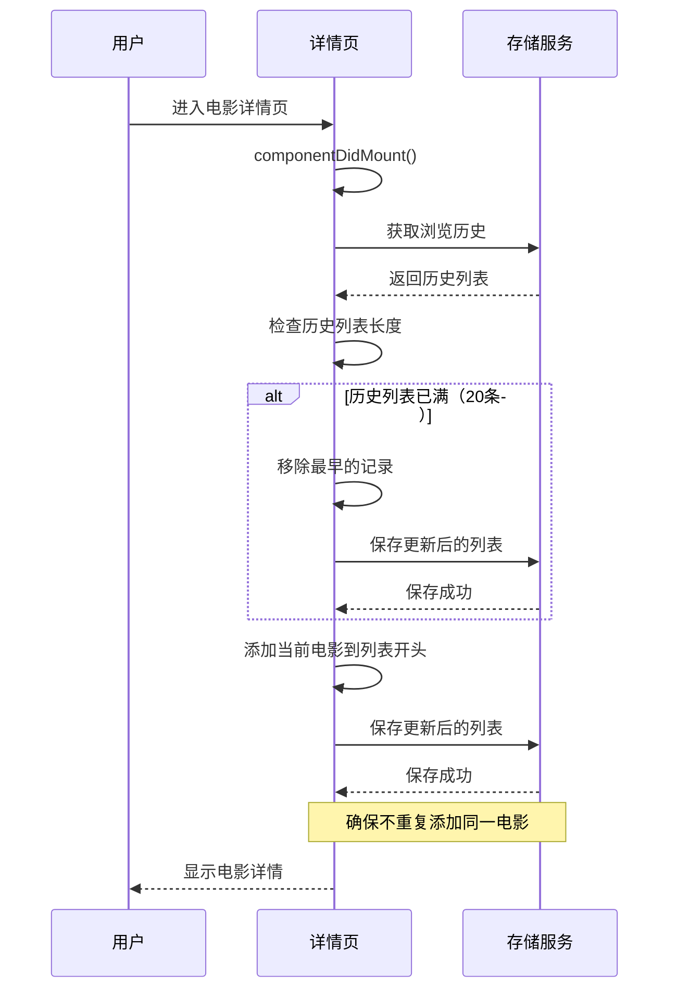

# 基于标签匹配的高分影视推荐+AI趣味影评小程序

## 详细设计说明书

---

## 一、引言

### （一）编写目的

本说明书旨在对"基于标签匹配的高分影视推荐+AI趣味影评小程序"进行详细设计，定义页面结构、组件设计、核心算法、接口设计、异常处理等，为开发人员提供具体的实现指导。

### （二）项目背景

随着互联网影视内容的爆炸式增长，用户面临"选择困难"问题。本项目通过标签匹配算法实现精准个性化推荐，并结合AI技术生成趣味影评，提升用户观影体验。

### （三）术语定义

| 术语 | 定义 |
|------|------|
| TMDB | The Movie Database，免费电影数据库API |
| 标签匹配 | 根据用户选择的标签与电影标签的匹配程度进行推荐 |
| AI影评 | 利用人工智能技术自动生成的电影评论 |
| Taro | 多端开发框架，支持React/Vue开发微信小程序、H5等 |

---

## 二、系统架构设计

### （一）类图设计



**类说明**：

| 类名 | 类型 | 职责 |
|------|------|------|
| App | 页面组件 | 应用根组件，全局状态管理 |
| HomePage | 页面组件 | 首页组件，电影列表展示 |
| TagsPage | 页面组件 | 标签选择页组件 |
| DetailPage | 页面组件 | 电影详情页组件 |
| MinePage | 页面组件 | 我的页组件 |
| MovieService | 服务类 | 电影数据服务 |
| AIService | 服务类 | AI影评生成服务 |
| StorageService | 工具类 | 本地存储服务 |
| Movie | 数据类 | 电影数据模型 |
| Tag | 数据类 | 标签数据模型 |

### （二）序列图设计

#### 2.1 标签推荐序列图



#### 2.2 AI影评生成序列图



#### 2.3 收藏功能序列图



#### 2.4 浏览历史记录序列图



### （一）总体架构

采用经典的MVC架构模式：

```
┌─────────────────────────────────────────┐
│              View（视图层）              │
│   Taro页面组件：首页、标签页、详情页、我的页   │
├─────────────────────────────────────────┤
│            Controller（控制层）          │
│     React Hooks状态管理、业务逻辑处理        │
├─────────────────────────────────────────┤
│              Model（模型层）             │
│      数据获取、存储、处理、算法计算          │
├─────────────────────────────────────────┤
│              外部依赖                    │
│   TMDB API、Silicon Flow API、本地存储     │
└─────────────────────────────────────────┘
```

### （二）模块划分

| 模块 | 子模块 | 文件路径 |
|------|--------|----------|
| 首页模块 | 搜索、标签筛选、电影列表 | src/pages/home/ |
| 标签模块 | 标签分类、选择、匹配计算 | src/pages/tags/ |
| 详情模块 | 电影详情、AI影评、收藏、相关推荐 | src/pages/detail/ |
| 我的模块 | 收藏列表、浏览历史 | src/pages/mine/ |
| 数据服务模块 | TMDB API、本地缓存、AI影评API | src/services/、src/data/ |
| 工具模块 | 存储、日志、工具函数 | src/utils/ |
| 组件模块 | 通用组件 | src/components/ |

### （三）技术选型

| 模块 | 技术 | 版本 |
|------|------|------|
| 前端框架 | Taro | 4.2.0 |
| 语言 | TypeScript | 5.x |
| 样式 | SCSS Modules | - |
| 状态管理 | React Hooks | - |
| 数据存储 | 微信小程序Storage | - |
| 第三方API | TMDB API、Silicon Flow API | - |

---

## 三、页面详细设计

### （一）首页设计（/pages/home）

#### 3.1.1 页面结构

```
┌──────────────────────────────────┐
│         搜索框组件               │
├──────────────────────────────────┤
│         标签筛选栏               │
│  [标签1] [标签2] [标签3] ...     │
├──────────────────────────────────┤
│         电影列表区域             │
│  ┌─────────────────────────┐    │
│  │   电影卡片1              │    │
│  │ 海报 | 标题 | 评分 | 年份│    │
│  └─────────────────────────┘    │
│  ┌─────────────────────────┐    │
│  │   电影卡片2              │    │
│  │ 海报 | 标题 | 评分 | 年份│    │
│  └─────────────────────────┘    │
│           ...                   │
└──────────────────────────────────┘
```

#### 3.1.2 组件设计

##### SearchBar组件

| 属性 | 类型 | 说明 |
|------|------|------|
| value | string | 当前搜索值 |
| onChange | (value: string) => void | 值变化回调 |
| onSearch | () => void | 搜索回调 |

##### TagFilter组件

| 属性 | 类型 | 说明 |
|------|------|------|
| tags | string[] | 标签列表 |
| selectedTags | string[] | 已选标签列表 |
| onTagClick | (tag: string) => void | 标签点击回调 |
| onMoreClick | () => void | 更多标签点击回调 |

##### MovieCard组件

| 属性 | 类型 | 说明 |
|------|------|------|
| movie | Movie | 电影数据 |
| onClick | () => void | 点击回调 |

#### 3.1.3 状态管理

| 状态 | 类型 | 初始值 | 说明 |
|------|------|--------|------|
| movies | Movie[] | [] | 电影列表 |
| selectedTags | string[] | [] | 选中标签 |
| searchKeyword | string | '' | 搜索关键词 |
| loading | boolean | false | 加载状态 |
| refreshing | boolean | false | 刷新状态 |

#### 3.1.4 交互逻辑

| 交互 | 处理逻辑 |
|------|----------|
| 页面加载 | 调用getMoviesFromTMDB获取电影列表 |
| 搜索 | 根据关键词过滤电影列表 |
| 标签点击 | 更新selectedTags，重新计算推荐 |
| 电影卡片点击 | 跳转到详情页，携带movieId |
| 下拉刷新 | 重新获取电影数据，更新列表 |
| 上拉加载 | 加载更多电影数据 |

### （二）标签页设计（/pages/tags）

#### 3.2.1 页面结构

```
┌──────────────────────────────────┐
│         搜索框组件               │
├──────────────────────────────────┤
│         分类导航                 │
│  [热门] [情感] [冒险] [科幻] ... │
├──────────────────────────────────┤
│         标签列表区域             │
│  ○ 标签1    ○ 标签2    ○ 标签3  │
│  ○ 标签4    ○ 标签5    ○ 标签6  │
│           ...                   │
├──────────────────────────────────┤
│         底部操作栏               │
│  [取消]                    [确认]│
└──────────────────────────────────┘
```

#### 3.2.2 组件设计

##### TagCategory组件

| 属性 | 类型 | 说明 |
|------|------|------|
| categories | string[] | 分类列表 |
| activeCategory | string | 当前选中分类 |
| onCategoryClick | (category: string) => void | 分类点击回调 |

##### TagItem组件

| 属性 | 类型 | 说明 |
|------|------|------|
| tag | Tag | 标签数据 |
| selected | boolean | 是否选中 |
| onClick | () => void | 点击回调 |

#### 3.2.3 状态管理

| 状态 | 类型 | 初始值 | 说明 |
|------|------|--------|------|
| tags | Tag[] | [] | 标签列表 |
| selectedTags | string[] | [] | 已选标签 |
| activeCategory | string | '热门' | 当前分类 |
| searchKeyword | string | '' | 搜索关键词 |

#### 3.2.4 交互逻辑

| 交互 | 处理逻辑 |
|------|----------|
| 页面加载 | 加载所有标签数据 |
| 分类切换 | 过滤显示对应分类的标签 |
| 标签点击 | 切换选中状态 |
| 搜索 | 根据关键词过滤标签 |
| 确认按钮 | 返回首页，应用选中标签 |
| 取消按钮 | 返回首页，取消选中 |

### （三）详情页设计（/pages/detail）

#### 3.3.1 页面结构

```
┌──────────────────────────────────┐
│         电影海报区域             │
│   ┌─────────────────────────┐   │
│   │                         │   │
│   │       电影海报           │   │
│   │                         │   │
│   └─────────────────────────┘   │
│  标题 | 评分 | 年份 | 时长      │
├──────────────────────────────────┤
│         电影信息区域             │
│  导演：xxx                      │
│  演员：xxx、xxx、xxx            │
│  简介：xxxxxxxxxxxx...          │
├──────────────────────────────────┤
│         AI影评区域              │
│  [搞笑吐槽] [文艺走心] [硬核解析] │
│  [朋友圈短句] [生成影评]         │
│  ┌─────────────────────────┐   │
│  │                         │   │
│  │     AI生成的影评         │   │
│  │                         │   │
│  └─────────────────────────┘   │
├──────────────────────────────────┤
│         收藏按钮                │
│  [收藏] / [已收藏]              │
├──────────────────────────────────┤
│         相关推荐                │
│  ┌─────────┐ ┌─────────┐       │
│  │ 电影1   │ │ 电影2   │       │
│  └─────────┘ └─────────┘       │
└──────────────────────────────────┘
```

#### 3.3.2 组件设计

##### MovieHeader组件

| 属性 | 类型 | 说明 |
|------|------|------|
| movie | Movie | 电影数据 |

##### AI Review组件

| 属性 | 类型 | 说明 |
|------|------|------|
| movie | Movie | 电影数据 |
| review | string | 当前影评 |
| loading | boolean | 加载状态 |
| onGenerate | (style: string) => void | 生成回调 |

##### RelatedMovies组件

| 属性 | 类型 | 说明 |
|------|------|------|
| movies | Movie[] | 相关电影列表 |
| onMovieClick | (movieId: string) => void | 电影点击回调 |

#### 3.3.3 状态管理

| 状态 | 类型 | 初始值 | 说明 |
|------|------|--------|------|
| movie | Movie \| null | null | 当前电影 |
| review | string | '' | AI影评 |
| reviewStyle | string | '搞笑吐槽' | 当前风格 |
| isFavorite | boolean | false | 是否收藏 |
| relatedMovies | Movie[] | [] | 相关推荐 |
| loading | boolean | false | 加载状态 |

#### 3.3.4 交互逻辑

| 交互 | 处理逻辑 |
|------|----------|
| 页面加载 | 根据movieId获取电影详情 |
| 生成影评 | 调用AI API生成对应风格的影评 |
| 风格切换 | 更新reviewStyle |
| 收藏/取消收藏 | 保存/删除收藏，更新本地存储 |
| 相关电影点击 | 跳转到对应电影详情页 |

### （四）我的页设计（/pages/mine）

#### 3.4.1 页面结构

```
┌──────────────────────────────────┐
│         用户信息区域             │
│   ┌──────┐                       │
│   │ 头像 │ 用户名                │
│   └──────┘                       │
├──────────────────────────────────┤
│         收藏列表                │
│  标题：我的收藏                 │
│  ┌─────────────────────────┐    │
│  │   收藏电影1              │    │
│  └─────────────────────────┘    │
│  ┌─────────────────────────┐    │
│  │   收藏电影2              │    │
│  └─────────────────────────┘    │
│           ...                   │
├──────────────────────────────────┤
│         浏览历史                │
│  标题：浏览历史 [清空]          │
│  ┌─────────────────────────┐    │
│  │   浏览电影1              │    │
│  └─────────────────────────┘    │
│           ...                   │
├──────────────────────────────────┤
│         关于我们                │
│  版本号：V1.0                  │
│  联系方式：xxx                 │
└──────────────────────────────────┘
```

#### 3.4.2 组件设计

##### UserHeader组件

| 属性 | 类型 | 说明 |
|------|------|------|
| userName | string | 用户名 |

##### FavoriteList组件

| 属性 | 类型 | 说明 |
|------|------|------|
| movies | Movie[] | 收藏电影列表 |
| onMovieClick | (movieId: string) => void | 电影点击回调 |
| onRemove | (movieId: string) => void | 移除收藏回调 |

##### HistoryList组件

| 属性 | 类型 | 说明 |
|------|------|------|
| movies | Movie[] | 浏览历史列表 |
| onMovieClick | (movieId: string) => void | 电影点击回调 |
| onClear | () => void | 清空历史回调 |

#### 3.4.3 状态管理

| 状态 | 类型 | 初始值 | 说明 |
|------|------|--------|------|
| favoriteMovies | Movie[] | [] | 收藏电影列表 |
| viewHistory | Movie[] | [] | 浏览历史列表 |
| loading | boolean | false | 加载状态 |

#### 3.4.4 交互逻辑

| 交互 | 处理逻辑 |
|------|----------|
| 页面加载 | 加载收藏列表和浏览历史 |
| 电影点击 | 跳转到详情页 |
| 取消收藏 | 从收藏列表移除，更新本地存储 |
| 清空历史 | 清空浏览历史，更新本地存储 |

---

## 四、核心算法设计

### （一）标签匹配推荐算法

#### 4.1.1 算法描述

- 输入：用户选中的标签列表
- 处理：计算每部电影与选中标签的匹配度
- 匹配度 = (匹配标签数) / (选中标签总数)
- 输出：按匹配度降序排列的电影列表

#### 4.1.2 流程图

```
开始
  │
  ▼
获取用户选中标签(selectedTags)
  │
  ▼
selectedTags.length === 0?
  │是           │否
  ▼             ▼
返回所有电影   遍历电影列表
              │
              ▼
          计算匹配标签数
              │
              ▼
          计算匹配度
              │
              ▼
          按匹配度排序
              │
              ▼
          过滤匹配度>0的电影
              │
              ▼
          返回推荐列表
              │
              ▼
结束
```

#### 4.1.3 伪代码

```
function getRecommendedByTags(selectedTags):
    if length(selectedTags) == 0:
        return getAllMovies()
    
    movies = getAllMovies()
    scoredMovies = []
    
    for each movie in movies:
        matchCount = 0
        for each tag in movie.tags:
            if tag in selectedTags:
                matchCount += 1
        
        matchScore = matchCount / length(selectedTags)
        add { movie, matchScore } to scoredMovies
    
    sort scoredMovies by matchScore descending
    filtered = filter scoredMovies where matchScore > 0
    return [movie for { movie, score } in filtered]
```

#### 4.1.4 复杂度分析

- 时间复杂度：O(n*m)，n为电影数量，m为标签数量
- 空间复杂度：O(n)

### （二）AI趣味影评生成

#### 4.2.1 API调用流程

```
开始
  │
  ▼
用户选择风格
  │
  ▼
构造Prompt模板
  │
  ▼
调用Silicon Flow API
  │
  ▼
API调用成功?
  │是           │否
  ▼             ▼
解析返回结果   提示错误信息
  │
  ▼
展示影评
  │
  ▼
结束
```

#### 4.2.2 Prompt模板设计

| 风格 | Prompt模板 |
|------|------------|
| 搞笑吐槽 | 请为电影《{title}》生成一篇搞笑吐槽风格的影评... |
| 文艺走心 | 请为电影《{title}》生成一篇文艺走心风格的影评... |
| 硬核解析 | 请为电影《{title}》生成一篇硬核解析风格的影评... |
| 朋友圈短句 | 请为电影《{title}》生成一句适合朋友圈分享的短评... |

#### 4.2.3 结果解析

```typescript
interface AIResponse {
  choices: Array<{
    message: {
      content: string;
    };
  }>;
}

function parseAIResponse(response: AIResponse): string {
  if (!response.choices || response.choices.length === 0) {
    return '';
  }
  return response.choices[0].message.content;
}
```

---

## 五、数据结构设计

### （一）Movie接口定义

```typescript
interface Movie {
  id: string;           // 电影ID
  title: string;        // 电影标题
  poster: string;       // 海报URL
  rating: number;       // 评分（0-10）
  year: number;         // 上映年份
  tags: string[];       // 标签列表
  description: string;  // 简介
  director: string;     // 导演
  actors: string[];     // 演员列表
  duration: string;     // 时长
  review: string;       // AI影评
}
```

### （二）Tag接口定义

```typescript
interface Tag {
  id: string;       // 标签ID
  name: string;     // 标签名称
  category: string; // 分类（热门、情感、冒险等）
  count: number;    // 使用次数
}
```

### （三）UserPreference接口定义

```typescript
interface UserPreference {
  favoriteMovies: string[]; // 收藏电影ID列表
  viewHistory: string[];    // 浏览历史ID列表
  selectedTags: string[];   // 选中标签列表
}
```

### （四）其他数据结构

#### TMDBMovie（TMDB API返回数据）

```typescript
interface TMDBMovie {
  id: number;
  title: string;
  poster_path: string;
  vote_average: number;
  release_date: string;
  genre_ids: number[];
  overview: string;
}
```

#### ReviewStyle（影评风格）

```typescript
type ReviewStyle = '搞笑吐槽' | '文艺走心' | '硬核解析' | '朋友圈短句';
```

---

## 六、接口详细设计

### （一）TMDB API接口

#### 6.1.1 获取高分电影

| 项目 | 说明 |
|------|------|
| API | GET /movie/top_rated |
| 参数 | api_key, language, page |
| 返回 | { page, results, total_pages } |

**请求示例**:
```
GET https://api.themoviedb.org/3/movie/top_rated?api_key=xxx&language=zh-CN&page=1
```

**响应示例**:
```json
{
  "page": 1,
  "results": [
    {
      "id": 550,
      "title": "搏击俱乐部",
      "poster_path": "/pB8BM7pdSp6B6Ih7QZ4DrQ3PmJK.jpg",
      "vote_average": 8.8,
      "release_date": "1999-10-15",
      "genre_ids": [18, 53],
      "overview": "电影简介..."
    }
  ],
  "total_pages": 500
}
```

#### 6.1.2 获取热门电影

| 项目 | 说明 |
|------|------|
| API | GET /movie/popular |
| 参数 | api_key, language, page |
| 返回 | { page, results, total_pages } |

#### 6.1.3 获取电影详情

| 项目 | 说明 |
|------|------|
| API | GET /movie/{id} |
| 参数 | api_key, language |
| 返回 | 电影详情对象 |

### （二）Silicon Flow API接口

#### 6.2.1 生成影评接口

| 项目 | 说明 |
|------|------|
| API | POST /chat/completions |
| 参数 | model, messages |
| 返回 | { choices } |

**请求示例**:
```json
{
  "model": "siliconflow-3.5",
  "messages": [
    {
      "role": "user",
      "content": "请为电影《搏击俱乐部》生成一篇搞笑吐槽风格的影评..."
    }
  ]
}
```

**响应示例**:
```json
{
  "choices": [
    {
      "message": {
        "content": "AI生成的影评内容..."
      }
    }
  ]
}
```

### （三）本地存储接口

#### 6.3.1 存储操作

| 方法 | 参数 | 返回值 | 说明 |
|------|------|--------|------|
| set | key: string, value: any | void | 保存数据 |
| get | key: string, defaultValue?: any | any | 获取数据 |
| remove | key: string | void | 删除数据 |

**使用示例**:
```typescript
// 保存收藏
storage.set('favoriteMovies', ['550', '680']);

// 获取收藏
const favorites = storage.get<string[]>('favoriteMovies', []);

// 删除数据
storage.remove('viewHistory');
```

---

## 七、状态管理设计

### （一）全局状态定义

```typescript
interface AppState {
  movies: Movie[];           // 电影列表
  selectedTags: string[];    // 选中标签
  searchKeyword: string;     // 搜索关键词
  currentPage: string;       // 当前页面
  loading: boolean;          // 加载状态
}
```

### （二）状态更新机制

| 触发条件 | 更新状态 | 触发动作 |
|----------|----------|----------|
| 用户选择标签 | selectedTags | 重新计算推荐 |
| 用户搜索 | searchKeyword | 过滤电影列表 |
| 数据加载完成 | movies | 更新页面渲染 |
| 页面切换 | currentPage | 更新导航状态 |

### （三）状态流转图

```
用户操作
    │
    ├── 选择标签 ──→ 更新selectedTags ──→ 计算推荐
    │
    ├── 搜索 ──→ 更新searchKeyword ──→ 过滤列表
    │
    ├── 加载数据 ──→ 更新movies ──→ 渲染页面
    │
    └── 页面切换 ──→ 更新currentPage ──→ 更新导航
```

---

## 八、异常处理设计

### （一）网络异常处理

| 异常类型 | 处理方式 | 代码位置 |
|----------|----------|----------|
| TMDB API连接超时 | 自动切换本地备选数据 | src/data/movies.ts |
| AI API调用失败 | 提示用户稍后重试 | src/services/aiReview.ts |
| 网络请求失败 | 展示友好提示 | 各页面组件 |

### （二）数据异常处理

| 异常类型 | 处理方式 | 代码位置 |
|----------|----------|----------|
| 电影数据为空 | 展示空状态提示 | 首页组件 |
| 标签匹配结果为空 | 提示"暂无匹配电影" | 推荐算法 |
| 存储操作失败 | 静默处理并记录日志 | src/utils/storage.ts |

### （三）用户操作异常处理

| 异常类型 | 处理方式 | 代码位置 |
|----------|----------|----------|
| 重复收藏 | 不重复添加 | 详情页组件 |
| 非法参数 | 过滤无效参数 | 服务层 |

---

## 九、安全设计

### （一）API密钥安全

- 通过环境变量配置API密钥
- 禁止在前端代码中硬编码密钥
- 使用代理服务器转发API请求（可选）

### （二）数据加密存储

- 用户数据使用base64编码存储
- 敏感数据加密后存储

### （三）防攻击措施

- 限制API调用频率
- 验证用户输入
- 防止SQL注入（虽然本项目无数据库）

---

## 十、部署方案

### （一）微信小程序部署

1. 运行 `npm run build:weapp` 编译项目
2. 生成 `dist/weapp` 目录
3. 微信开发者工具导入项目
4. 配置小程序基础信息（appid等）
5. 提交审核上线

### （二）H5部署

1. 运行 `npm run build:h5` 编译项目
2. 生成 `dist/h5` 目录
3. 部署到静态服务器（如Nginx、阿里云OSS）
4. 配置域名和HTTPS

### （三）测试环境部署

- 使用微信开发者工具进行本地测试
- 使用真机调试验证功能
- 使用H5预览验证多端适配

---

## 十一、代码目录结构

### （一）目录组织

```
src/
├── app.tsx                    # 应用入口
├── app.scss                   # 全局样式
├── app.config.ts              # 应用配置
├── pages/                     # 页面目录
│   ├── home/                  # 首页
│   │   ├── index.tsx          # 页面组件
│   │   ├── index.module.scss  # 页面样式
│   │   └── index.config.ts    # 页面配置
│   ├── tags/                  # 标签页
│   ├── detail/                # 详情页
│   └── mine/                  # 我的页
├── components/                # 组件目录
│   ├── MovieCard/             # 电影卡片组件
│   ├── TagItem/               # 标签项组件
│   ├── RatingStar/            # 评分星星组件
│   └── ReviewCard/            # 影评卡片组件
├── services/                  # 服务目录
│   ├── tmdb.ts                # TMDB API服务
│   ├── aiReview.ts            # AI影评服务
│   └── movie.ts               # 影视服务
├── data/                      # 数据目录
│   ├── movies.ts              # 电影数据管理
│   └── tags.ts                # 标签数据
├── utils/                     # 工具目录
│   ├── storage.ts             # 存储工具
│   └── format.ts              # 格式化工具
├── types/                     # 类型定义目录
│   ├── movie.ts               # 电影类型
│   ├── tag.ts                 # 标签类型
│   └── user.ts                # 用户类型
└── store/                     # 状态管理目录
    └── useAppStore.tsx        # 全局状态管理
```

### （二）文件职责说明

| 文件 | 职责 |
|------|------|
| app.tsx | 应用入口，配置全局状态 |
| pages/home/index.tsx | 首页组件，展示电影列表和筛选 |
| pages/tags/index.tsx | 标签页组件，标签选择和匹配 |
| pages/detail/index.tsx | 详情页组件，电影详情和AI影评 |
| pages/mine/index.tsx | 我的页组件，收藏和历史 |
| services/tmdb.ts | TMDB API调用封装 |
| services/aiReview.ts | AI影评API调用封装 |
| data/movies.ts | 电影数据管理和推荐算法 |
| utils/storage.ts | 本地存储工具函数 |
| types/movie.ts | Movie类型定义 |

---

## 十二、测试计划

### （一）功能测试用例

#### 首页测试用例

| 用例ID | 测试场景 | 预期结果 |
|--------|----------|----------|
| TC001 | 页面加载 | 显示高分电影列表 |
| TC002 | 搜索电影 | 显示匹配关键词的电影 |
| TC003 | 标签筛选 | 显示匹配标签的电影 |
| TC004 | 下拉刷新 | 更新电影列表 |
| TC005 | 上拉加载 | 加载更多电影 |

#### 标签页测试用例

| 用例ID | 测试场景 | 预期结果 |
|--------|----------|----------|
| TC006 | 分类切换 | 显示对应分类的标签 |
| TC007 | 标签选择 | 标签变为选中状态 |
| TC008 | 标签搜索 | 显示匹配关键词的标签 |
| TC009 | 确认选择 | 返回首页，应用选中标签 |

#### 详情页测试用例

| 用例ID | 测试场景 | 预期结果 |
|--------|----------|----------|
| TC010 | 加载电影详情 | 显示电影完整信息 |
| TC011 | 生成搞笑吐槽影评 | 生成幽默风格影评 |
| TC012 | 生成文艺走心影评 | 生成感性风格影评 |
| TC013 | 添加收藏 | 电影加入收藏列表 |
| TC014 | 取消收藏 | 电影从收藏列表移除 |
| TC015 | 查看相关推荐 | 显示相同标签的电影 |

#### 我的页测试用例

| 用例ID | 测试场景 | 预期结果 |
|--------|----------|----------|
| TC016 | 加载收藏列表 | 显示用户收藏的电影 |
| TC017 | 加载浏览历史 | 显示用户浏览过的电影 |
| TC018 | 清空浏览历史 | 浏览历史被清空 |

### （二）性能测试用例

| 用例ID | 测试场景 | 预期结果 |
|--------|----------|----------|
| TC019 | 首屏加载时间 | ≤3秒 |
| TC020 | 标签筛选响应时间 | ≤1秒 |
| TC021 | AI影评生成时间 | ≤5秒 |
| TC022 | 下拉刷新时间 | ≤2秒 |

### （三）兼容性测试用例

| 用例ID | 测试场景 | 预期结果 |
|--------|----------|----------|
| TC023 | iOS系统 | 功能正常 |
| TC024 | Android系统 | 功能正常 |
| TC025 | 不同屏幕尺寸 | 布局正常 |
| TC026 | 不同基础库版本 | 功能正常 |

### （四）异常测试用例

| 用例ID | 测试场景 | 预期结果 |
|--------|----------|----------|
| TC027 | TMDB API连接失败 | 自动切换本地数据 |
| TC028 | AI API调用失败 | 提示错误信息 |
| TC029 | 无网络连接 | 显示网络错误提示 |
| TC030 | 无匹配标签 | 提示"暂无匹配电影" |

---

**文档日期**: 2026年6月
**文档版本**: V1.0
