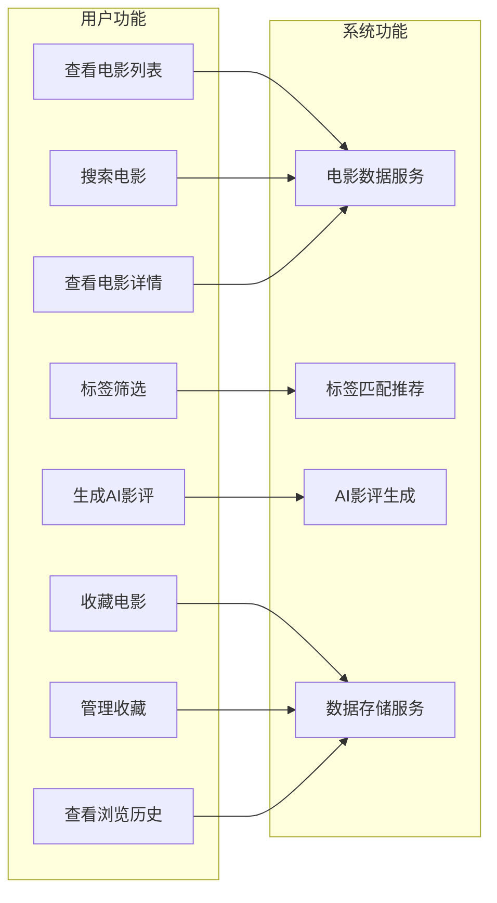

# 基于标签匹配的高分影视推荐+AI趣味影评小程序

## 需求规格说明书

---

## 一、引言

### （一）编写目的

本说明书旨在明确"基于标签匹配的高分影视推荐+AI趣味影评小程序"的功能需求、非功能需求、数据需求和界面需求，为项目开发提供详细的指导。

### （二）项目背景

随着互联网影视内容的爆炸式增长，用户面临"选择困难"问题。传统影视推荐主要依赖协同过滤或基于内容的推荐算法，缺乏个性化和趣味性。本项目旨在通过标签匹配算法实现精准推荐，并结合AI技术生成趣味影评，提升用户观影体验。

### （三）术语定义

| 术语 | 定义 |
|------|------|
| TMDB | The Movie Database，免费电影数据库API |
| 标签匹配 | 根据用户选择的标签与电影标签的匹配程度进行推荐 |
| AI影评 | 利用人工智能技术自动生成的电影评论 |
| Taro | 多端开发框架，支持React/Vue开发微信小程序、H5等 |

---

## 二、需求概述

### （一）功能需求概述

| 模块 | 功能 | 优先级 |
|------|------|--------|
| 首页 | 电影列表展示、标签筛选、搜索 | 高 |
| 标签页 | 标签分类、选择、匹配计算 | 高 |
| 详情页 | 电影详情、AI影评、收藏、相关推荐 | 高 |
| 我的页 | 收藏列表、浏览历史 | 中 |
| 数据服务 | TMDB API、本地缓存、AI影评API | 高 |

### （二）非功能需求概述

| 需求类型 | 要求 |
|----------|------|
| 性能 | 首屏加载≤3秒，标签筛选≤1秒，AI影评生成≤5秒 |
| 兼容性 | 支持微信小程序基础库≥2.20.0，iOS/Android系统 |
| 可用性 | 用户操作路径≤3层，界面简洁美观 |
| 安全性 | API密钥安全存储，用户数据加密 |

---

## 三、功能需求详细描述

### （一）用例图



### （二）用例描述

#### 用例1：查看电影列表

| 项目 | 内容 |
|------|------|
| **用例编号** | UC-001 |
| **用例名称** | 查看电影列表 |
| **参与者** | 普通用户 |
| **前置条件** | 用户打开小程序首页 |
| **后置条件** | 显示电影列表或空状态提示 |
| **基本流程** | 1. 用户打开应用<br>2. 系统加载电影数据<br>3. 系统显示电影列表 |
| **备选流程** | 1a. 加载失败<br>&nbsp;&nbsp;1. 系统显示本地备选数据<br>2a. 数据为空<br>&nbsp;&nbsp;1. 系统显示"暂无电影"提示 |

#### 用例2：搜索电影

| 项目 | 内容 |
|------|------|
| **用例编号** | UC-002 |
| **用例名称** | 搜索电影 |
| **参与者** | 普通用户 |
| **前置条件** | 用户在首页搜索框输入关键词 |
| **后置条件** | 显示搜索结果或空状态 |
| **基本流程** | 1. 用户点击搜索框<br>2. 用户输入关键词<br>3. 系统实时显示匹配结果 |
| **备选流程** | 1a. 无匹配结果<br>&nbsp;&nbsp;1. 系统显示"未找到相关电影"提示 |

#### 用例3：标签筛选电影

| 项目 | 内容 |
|------|------|
| **用例编号** | UC-003 |
| **用例名称** | 标签筛选电影 |
| **参与者** | 普通用户 |
| **前置条件** | 用户选择标签 |
| **后置条件** | 显示匹配的电影列表 |
| **基本流程** | 1. 用户点击标签<br>2. 系统更新已选标签<br>3. 系统计算标签匹配度<br>4. 系统显示推荐结果 |
| **备选流程** | 1a. 无匹配结果<br>&nbsp;&nbsp;1. 系统显示"暂无匹配电影"提示 |

#### 用例4：查看电影详情

| 项目 | 内容 |
|------|------|
| **用例编号** | UC-004 |
| **用例名称** | 查看电影详情 |
| **参与者** | 普通用户 |
| **前置条件** | 用户点击电影卡片 |
| **后置条件** | 显示电影详细信息 |
| **基本流程** | 1. 用户点击电影卡片<br>2. 系统跳转详情页<br>3. 系统加载电影详情<br>4. 系统显示详情信息 |
| **扩展流程** | 4a. 用户点击相关推荐<br>&nbsp;&nbsp;1. 系统跳转至对应电影详情页 |

#### 用例5：生成AI影评

| 项目 | 内容 |
|------|------|
| **用例编号** | UC-005 |
| **用例名称** | 生成AI影评 |
| **参与者** | 普通用户 |
| **前置条件** | 用户在电影详情页 |
| **后置条件** | 显示生成的影评或错误提示 |
| **基本流程** | 1. 用户选择影评风格<br>2. 用户点击生成按钮<br>3. 系统调用AI API<br>4. 系统显示生成的影评 |
| **备选流程** | 3a. API调用失败<br>&nbsp;&nbsp;1. 系统显示"生成失败，请重试"提示 |

#### 用例6：收藏电影

| 项目 | 内容 |
|------|------|
| **用例编号** | UC-006 |
| **用例名称** | 收藏电影 |
| **参与者** | 普通用户 |
| **前置条件** | 用户在电影详情页 |
| **后置条件** | 电影收藏状态更新 |
| **基本流程** | 1. 用户点击收藏按钮<br>2. 系统保存收藏信息<br>3. 系统更新收藏状态 |
| **备选流程** | 1a. 重复收藏<br>&nbsp;&nbsp;1. 系统提示"已收藏" |

#### 用例7：管理收藏列表

| 项目 | 内容 |
|------|------|
| **用例编号** | UC-007 |
| **用例名称** | 管理收藏列表 |
| **参与者** | 普通用户 |
| **前置条件** | 用户在我的页面 |
| **后置条件** | 收藏列表显示或更新 |
| **基本流程** | 1. 用户进入我的页<br>2. 系统加载收藏列表<br>3. 系统显示收藏电影 |
| **扩展流程** | 3a. 用户取消收藏<br>&nbsp;&nbsp;1. 系统移除收藏记录<br>&nbsp;&nbsp;2. 系统更新列表显示 |

#### 用例8：查看浏览历史

| 项目 | 内容 |
|------|------|
| **用例编号** | UC-008 |
| **用例名称** | 查看浏览历史 |
| **参与者** | 普通用户 |
| **前置条件** | 用户在我的页面 |
| **后置条件** | 浏览历史显示或清空 |
| **基本流程** | 1. 用户进入我的页<br>2. 系统加载浏览历史<br>3. 系统显示历史记录 |
| **扩展流程** | 3a. 用户清空历史<br>&nbsp;&nbsp;1. 系统清空浏览记录<br>&nbsp;&nbsp;2. 系统更新列表显示 |

### （三）外部接口需求

#### 3.1 用户界面接口

| 接口名称 | 说明 | 输入 | 输出 |
|----------|------|------|------|
| 首页界面 | 电影列表展示主界面 | 用户选择、搜索关键词、标签 | 电影列表、筛选结果 |
| 标签选择界面 | 标签管理和选择界面 | 标签选择操作 | 已选标签列表 |
| 电影详情界面 | 电影详细信息展示 | 电影ID | 电影详情、AI影评 |
| 我的页面 | 用户个人中心 | 用户操作 | 收藏列表、历史记录 |

#### 3.2 硬件接口

| 接口名称 | 说明 | 要求 |
|----------|------|------|
| 移动设备 | 智能手机 | 支持微信小程序 |
| 网络连接 | 互联网访问 | 4G/5G/WiFi |

#### 3.3 软件接口

| 接口名称 | 说明 | 协议 | 数据格式 |
|----------|------|------|----------|
| TMDB API | 电影数据接口 | HTTPS REST | JSON |
| Silicon Flow API | AI影评接口 | HTTPS REST | JSON |
| 微信Storage | 本地存储接口 | 微信小程序API | 键值对 |

#### 3.4 通信接口

| 接口名称 | 说明 | 协议 | 端口 |
|----------|------|------|------|
| HTTPS | 安全的网络通信 | HTTPS | 443 |
| WebSocket | 实时通信（如需要） | WSS | 443 |

### （四）首页功能

#### 1.1 电影列表展示

- 展示高分电影列表，默认按评分排序
- 电影卡片包含：海报、标题、评分、年份、标签
- 支持下拉刷新和上拉加载更多

#### 1.2 标签筛选

- 标签筛选栏，支持多选
- 点击标签可切换选中状态
- 筛选后列表按匹配度排序

#### 1.3 搜索功能

- 关键词搜索框
- 搜索电影标题
- 实时搜索结果展示

#### 1.4 交互逻辑

- 点击电影卡片跳转到详情页
- 点击标签跳转到标签选择页

### （二）标签选择页功能

#### 2.1 标签分类展示

- 标签按分类展示：热门、情感、冒险、科幻、喜剧等
- 每个标签显示名称和使用次数

#### 2.2 标签选择

- 支持多标签选择
- 全选/取消全选功能
- 已选标签数量显示

#### 2.3 搜索功能

- 标签名称搜索
- 实时搜索结果展示

#### 2.4 交互逻辑

- 点击标签切换选中状态
- 点击确认按钮返回首页展示推荐结果

### （三）电影详情页功能

#### 3.1 电影信息展示

- 电影海报、标题、评分、年份
- 电影简介、导演、演员信息
- 电影时长

#### 3.2 AI趣味影评生成

- AI影评生成按钮
- 支持4种风格：搞笑吐槽、文艺走心、硬核解析、朋友圈短句
- 生成的影评展示区域

#### 3.3 收藏功能

- 收藏/取消收藏按钮
- 收藏状态实时更新
- 收藏列表持久化存储

#### 3.4 相关推荐

- 展示相同标签的电影
- 最多展示5部相关电影

#### 3.5 交互逻辑

- 点击生成按钮调用AI API生成影评
- 点击收藏按钮保存到本地存储
- 点击相关电影跳转到详情页

### （四）我的页面功能

#### 4.1 收藏列表

- 展示用户收藏的电影列表
- 支持取消收藏
- 点击电影跳转到详情页

#### 4.2 浏览历史

- 展示用户浏览过的电影列表
- 支持清空历史
- 点击电影跳转到详情页

#### 4.3 关于我们

- 项目介绍
- 版本信息
- 联系方式

---

## 四、核心算法需求

### （一）标签匹配推荐算法

#### 4.1.1 算法描述

- 输入：用户选中的标签列表
- 处理：计算每部电影与选中标签的匹配度
- 匹配度 = (匹配标签数) / (选中标签总数)
- 输出：按匹配度降序排列的电影列表

#### 4.1.2 算法流程

1. 遍历所有电影数据
2. 对每部电影计算匹配标签数
3. 计算匹配度
4. 按匹配度降序排序
5. 过滤匹配度大于0的电影

#### 4.1.3 算法复杂度

- 时间复杂度：O(n*m)，n为电影数量，m为标签数量
- 空间复杂度：O(n)

### （二）AI趣味影评生成

#### 4.2.1 API调用流程

1. 构造Prompt模板
2. 调用Silicon Flow API
3. 解析返回结果
4. 展示给用户

#### 4.2.2 支持风格

| 风格 | 描述 |
|------|------|
| 搞笑吐槽 | 幽默风趣的吐槽式影评 |
| 文艺走心 | 感性细腻的文艺影评 |
| 硬核解析 | 深度分析的专业影评 |
| 朋友圈短句 | 适合社交分享的短评 |

---

## 五、数据需求分析

### （一）数据来源

| 数据源 | 用途 | 说明 |
|--------|------|------|
| TMDB API | 电影数据 | 高分电影、热门电影、电影详情 |
| Silicon Flow API | AI影评 | 生成趣味影评 |
| 本地存储 | 用户数据 | 收藏列表、浏览历史、选中标签 |

### （二）数据结构设计

#### 5.2.1 Movie（电影）

| 字段名 | 类型 | 说明 |
|--------|------|------|
| id | string | 电影ID |
| title | string | 电影标题 |
| poster | string | 海报URL |
| rating | number | 评分（0-10） |
| year | number | 上映年份 |
| tags | string[] | 标签列表 |
| description | string | 简介 |
| director | string | 导演 |
| actors | string[] | 演员列表 |
| duration | string | 时长 |
| review | string | AI影评 |

#### 5.2.2 Tag（标签）

| 字段名 | 类型 | 说明 |
|--------|------|------|
| id | string | 标签ID |
| name | string | 标签名称 |
| category | string | 分类 |
| count | number | 使用次数 |

#### 5.2.3 UserPreference（用户偏好）

| 字段名 | 类型 | 说明 |
|--------|------|------|
| favoriteMovies | string[] | 收藏电影ID列表 |
| viewHistory | string[] | 浏览历史ID列表 |
| selectedTags | string[] | 选中标签列表 |

### （三）数据存储方案

| 存储位置 | 存储内容 | 存储方式 |
|----------|----------|----------|
| 微信小程序Storage | 用户收藏、浏览历史、选中标签 | 键值对存储 |
| 内存缓存 | 电影数据 | 30分钟有效期 |
| 本地JSON | 备选电影数据 | 静态文件 |

---

## 六、界面需求分析

### （一）页面结构

```
├── 首页（/pages/home）
│   ├── 搜索框
│   ├── 标签筛选栏
│   ├── 电影列表（卡片式）
│   └── 下拉刷新/上拉加载
├── 标签页（/pages/tags）
│   ├── 标签分类导航
│   ├── 标签列表（可多选）
│   └── 搜索框
├── 详情页（/pages/detail）
│   ├── 电影海报
│   ├── 电影信息（标题、评分、年份、导演、演员）
│   ├── 电影简介
│   ├── AI影评生成区
│   ├── 收藏按钮
│   └── 相关推荐
└── 我的页（/pages/mine）
    ├── 用户头像区域
    ├── 收藏列表
    ├── 浏览历史
    └── 关于我们
```

### （二）交互流程

#### 6.2.1 推荐流程

用户选择标签 → 点击确认 → 计算匹配度 → 展示推荐结果 → 点击电影 → 查看详情

#### 6.2.2 影评生成流程

进入详情页 → 选择风格 → 点击生成 → 调用AI API → 展示影评

#### 6.2.3 收藏流程

进入详情页 → 点击收藏 → 保存到本地存储 → 更新收藏状态

### （三）设计规范

| 项目 | 规范 |
|------|------|
| 配色 | 主题色：蓝色系，背景：浅色 |
| 字体 | 标题：粗体，正文：常规 |
| 间距 | 统一间距标准，保持视觉一致性 |
| 图标 | 使用统一风格的图标 |

---

## 七、技术方案建议

### （一）技术选型

| 模块 | 技术 | 理由 |
|------|------|------|
| 前端框架 | Taro 4.2.0 | 多端适配，开发效率高 |
| 语言 | TypeScript | 类型安全，代码健壮 |
| 状态管理 | React Hooks | 轻量级，易于维护 |
| 样式 | SCSS Modules | 模块化，避免样式冲突 |
| 构建工具 | Webpack 5 | 性能优化，生态成熟 |

### （二）架构设计

采用MVC架构，分离关注点：
- 视图层：负责UI展示
- 控制层：处理业务逻辑
- 模型层：管理数据

### （三）关键技术点

1. 标签匹配算法实现
2. AI API调用和结果解析
3. 本地缓存策略
4. 微信小程序适配

---

## 八、开发计划与里程碑

### （一）阶段划分

| 阶段 | 时间 | 任务 |
|------|------|------|
| 第一阶段 | 第1周 | 基础框架搭建，首页开发 |
| 第二阶段 | 第2-3周 | 标签页开发，标签匹配算法实现 |
| 第三阶段 | 第4-5周 | 详情页开发，AI影评集成 |
| 第四阶段 | 第6周 | 我的页开发，功能优化 |
| 第五阶段 | 第7-8周 | 测试修复，审核上线 |

### （二）里程碑

| 里程碑 | 时间 | 交付物 |
|--------|------|--------|
| M1 | 第1周 | 基础框架完成 |
| M2 | 第3周 | 首页和标签页完成 |
| M3 | 第5周 | 详情页和AI影评完成 |
| M4 | 第6周 | 所有功能完成 |
| M5 | 第8周 | 测试通过，上线发布 |

### （三）资源需求

| 角色 | 人数 | 职责 |
|------|------|------|
| 前端开发 | 1-2人 | 页面开发、功能实现 |
| UI设计 | 1人 | 界面设计、交互设计 |
| 测试 | 1人 | 功能测试、性能测试 |
| 项目管理 | 1人 | 进度管理、协调沟通 |

---

## 九、风险识别与应对

### （一）技术风险

| 风险 | 应对措施 |
|------|----------|
| TMDB API访问不稳定 | 添加本地备选数据 |
| AI API调用失败 | 添加错误处理和重试机制 |
| 微信小程序审核不通过 | 提前了解审核规范 |

### （二）市场风险

| 风险 | 应对措施 |
|------|----------|
| 用户增长缓慢 | 优化推广策略 |
| 竞争加剧 | 持续优化产品 |

### （三）运营风险

| 风险 | 应对措施 |
|------|----------|
| 推广费用超支 | 制定预算计划 |
| 内容违规 | 加强内容审核 |

---

**文档日期**: 2026年6月
**文档版本**: V1.0
